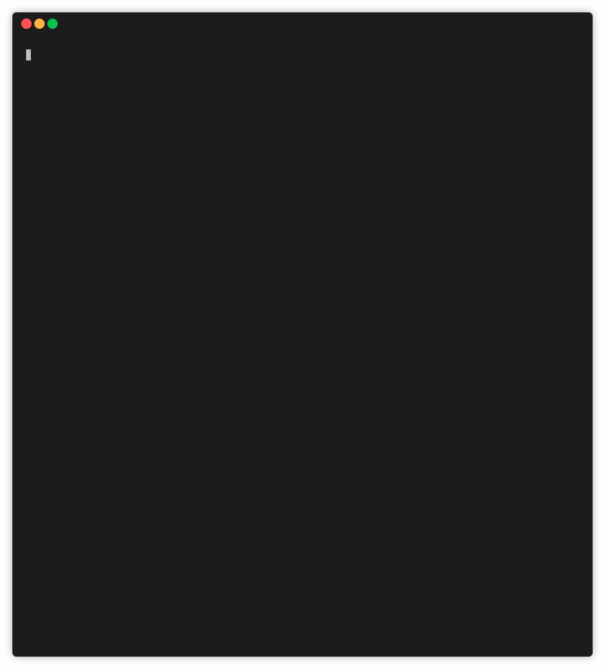
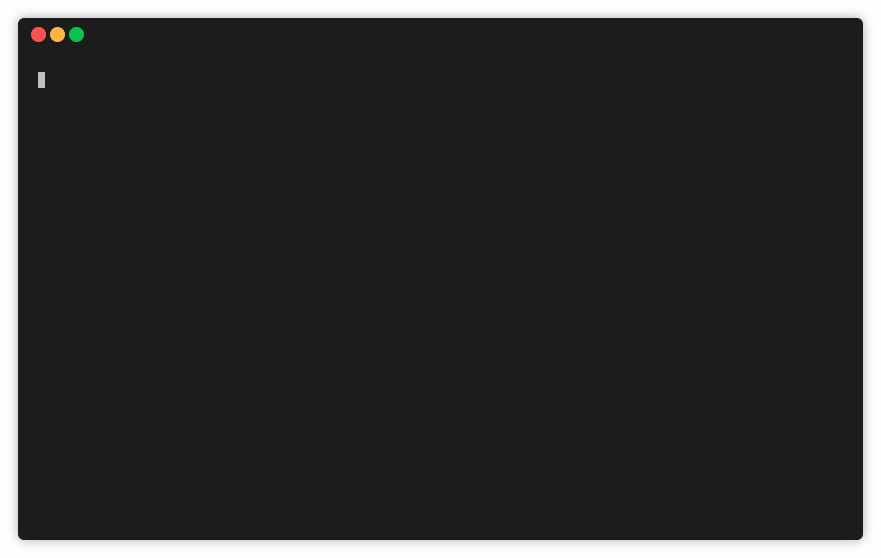
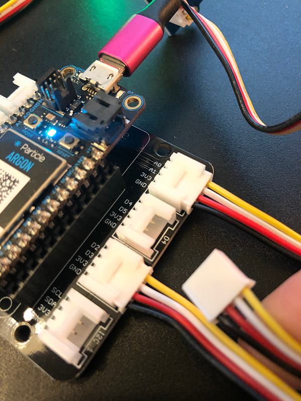

# Lab 3: Exploring BLE and Advanced Device OS Features

| **Project Goal**            | Use BLE to broadcast device details to a web app; Use system events and sleep to respond to external inputs.                                                                                        |
| --------------------------- | ------------------------------------------------------------------------------------------------------------------------------------------------------------------------- |
| **What you’ll learn**       | Working with Bluetooth on Particle Devices, using advanced Device OS features like threads, system events, and sleep modes. |
| **Tools you’ll need**       | Particle Workbench, a Particle Argon, and the IoT Starter, The Particle CLI Kit.                                                                                                            |
| **Time needed to complete** | 60 minutes  

In this lab, you're going to start exploring some Particle power-user features, starting with the Particle CLI and BLE, before moving onto some advanced Device OS features like system events and sleep.  If you get stuck at any point during this session, [click here for the completed, working source](https://go.particle.io/shared_apps/5e5ebba381620d0007ad4e0e).

## Exploring the Particle CLI and Device Cloud API

### The Particle CLI

1.  If you haven't already, [install the Particle CLI](https://docs.particle.io/guide/tools-and-features/cli/photon/). Open a terminal window and type the following command:

```bash
bash <( curl -sL https://particle.io/install-cli )
```

2.  Type `particle login` and enter your Particle account email and password when prompted.


3.  Once you're logged in, type `particle list` to see your list of online devices.



4.  The device you've been using for this workshop has two variables and one function. Get the value of the `temp` variable with the command `particle get temp`.


5.  You can also call one of the two functions to light up the yellow or blue LED button. Type the command `particle call <your-device-name> toggleLed` in the terminal. Run the same command again to turn the light off.

### The Particle Device Cloud API

Behind the scenes, every interface that Particle provides to work with devices, from the Console, to mobile apps, SDKs, and the CLI, they all talk through a RESTful Device Cloud API. You can even call yourself, directly.

_The next few steps assume you have cURL installed on your machine. If you don't have this command-line utility on your machine, you can download and install it [here](https://curl.haxx.se/download.html) or use a GUI-based tool like [Postman](https://www.getpostman.com/)._

1.  First, you'll need to obtain an access token from the CLI. Type `particle token list` to view the tokens associated with your account. The first one listed is your `user` token, and can be used to access the Device Cloud API. If no tokens are listed, generate a new one with `particle token new`.

2.  With your token and Device ID in hand, type the following cURL command into a terminal window, replacing the text below in `< >` with your information.

```bash
curl https://api.particle.io/v1/devices?access_token=<your token>
```

By default, the response will generate a wall of text in your terminal. If you have Python 2.6+ installed on your machine, you can pipe the output to the `json.tool` and get pretty-printed JSON.

```bash
curl https://api.particle.io/v1/devices\?access_token\=<your token>
| python -m json.tool
```


3.  For this next command, you need the Device ID of the Photon attached to your badge. You can find that in the console or via the `particle list` CLI command.

4.  Let's call the `toggleLed` function using the Device Cloud API. Type the following, again replacing the text below in `< >` with your information.

```bash
curl https://api.particle.io/v1/devices/<device id>/toggleB \
     -d access_token=<your token>
```



You've now explored a number of ways that you can interface with the Particle Device cloud and your connected devices! Now, let's go beyond the Particle ecosystem and explore some of the ways that you can integrate with other 3rd party services, and backhaul your data into other cloud services.

## Working with Bluetooth on Particle Devices

For the last section of this lab, we'll explore using BLE to advertise data from your device. Specifically, we'll use BLE to advertise the uptime, WiFi signal strength and free memory on your device, which you'll then read from a browser using Web BLE and Chrome.

### Using Bluetooth with Particle Gen3 Devices

1. To use Bluetooth with a Gen3 device, you'll need to be running Device OS version 1.3.0 or greater. To set this in Workbench, open the command palette (SHIFT + CMD/CTRL + P), select the "Configure Project for Device" option and select version "deviceOS@1.3.0" or newer.

2. Next, you'll want to install a new library to help with getting power and battery info from your device. Open the command palette, select the "Install Library" command and enter "DiagnosticsHelperRK" into the textbox. Hit enter and the library will be installed.

3. At the top of your project, add an include for the DiagnosticsHelper library.

```cpp
#include "DiagnosticsHelperRK.h"
```

4. Now, let's turn on threading in the app, using the `SYSTEM_THREAD` command below. This opt-in change will allow your user firmware and system firmware to run on separate threads, which can speed things up when you're doing cloud publishes and local operations like Bluetooth.

```
SYSTEM_THREAD(ENABLED);
```

5. Now, add a UUID for the service, and three characteristic objects to represent uptime, signal strength, and free memory. The service UUID is arbitrary and you should change it from the default below using a UUID generator like the one [here](https://www.uuidgenerator.net/). Keep track of the UUID you create here  because you'll need it in the next section as well. The Service UUIDs should remain unchanged.

```cpp
// Private battery and power service UUID
const BleUuid serviceUuid("5c1b9a0d-b5be-4a40-8f7a-66b36d0a5176"); // CHANGE ME

BleCharacteristic uptimeCharacteristic("uptime", BleCharacteristicProperty::NOTIFY, BleUuid("fdcf4a3f-3fed-4ed2-84e6-04bbb9ae04d4"), serviceUuid);
BleCharacteristic signalStrengthCharacteristic("strength", BleCharacteristicProperty::NOTIFY, BleUuid("cc97c20c-5822-4800-ade5-1f661d2133ee"), serviceUuid);
BleCharacteristic freeMemoryCharacteristic("freeMemory", BleCharacteristicProperty::NOTIFY, BleUuid("d2b26bf3-9792-42fc-9e8a-41f6107df04c"), serviceUuid);
```

6. Next, create a function to configure and set-up BLE advertising from your device. This snippet will add the three characteristics you defined above, as well as the service UUID you specified, and will advertise itself as a connectable device.

```cpp
void configureBLE()
{
  BLE.addCharacteristic(uptimeCharacteristic);
  BLE.addCharacteristic(signalStrengthCharacteristic);
  BLE.addCharacteristic(freeMemoryCharacteristic);

  BleAdvertisingData advData;

  // Advertise our private service only
  advData.appendServiceUUID(serviceUuid);

  // Continuously advertise when not connected
  BLE.advertise(&advData);
}
```

7. At the end of your `setup` function, call the function you just created.

```cpp
configureBLE();
```

### Refactoring out the blocking delay

Next, let's modify the `loop` function. We'll start by refactoring our firmware to remove the `delay` in the loop. While the delay approach is common when getting started with creating embedded applications, it's a blocking operation. This means that any calls you make to the device during a delay may timeout before being received.

One common way to write periodic code without using `delay` is to use the built-in `millis()` function and keep track of the elapsed time between the last time you performed an operation (like a temp check) and the wait time between operations.

1. First, let's add some global variables to hold the last check time and an interval. Add the following to the top of your project, outside of the `setup` and `loop`.

```cpp
const unsigned long UPDATE_INTERVAL = 2000;
unsigned long lastUpdate = 0;
```

2. Now, in the `loop`, add a local variable to hold the current time elapsed. The `millis()` function returns the number of milliseconds that have elapsed since your device began running the current program. 

```cpp
unsigned long currentMillis = millis();
```

3. Next, remove the `delay` at the end of your loop function. Then, wrap the rest of the code with an if statement to see if the `UPDATE_INTERVAL` time has elapsed.

Make sure you also update the `lastUpdate` variable to the current `millis` time or this `if` statement will never evaluate to `true` after the first time it runs.

```cpp
if (currentMillis - lastUpdate >= UPDATE_INTERVAL)
{
  lastUpdate = millis();

  /* rest of Loop code here */ 
}
```

Your `loop` should now look like this:

```cpp
void loop()
{
  unsigned long currentMillis = millis();

  if (currentMillis - lastUpdate >= UPDATE_INTERVAL)
  {
    lastUpdate = millis();

    temp = dht.getTempFarenheit();
    humidity = dht.getHumidity();

    temp_dbl = temp;
    humidity_dbl = humidity;

    Serial.printlnf("Temp: %f", temp_dbl);
    Serial.printlnf("Humidity: %f", humidity_dbl);

    double lightAnalogVal = analogRead(A0);
    currentLightLevel = map(lightAnalogVal, 0.0, 4095.0, 0.0, 100.0);

    if (currentLightLevel > 50)
    {
      Particle.publish("light-meter/level", String(currentLightLevel), PRIVATE);
    }
  }
}
```

4. Now, let's add our BLE logic to the `loop`, after the `currentLightLevel` if statement. In this code, we check to see if another device (a peripheral) is connected to our Argon. If so. we'll use the diagnostics library to get the device uptime, signal strength and free memory, and set those values to our characteristics, so the connected client can read them.

```cpp
if (BLE.connected())
{
  uint8_t uptime = (uint8_t)DiagnosticsHelper::getValue(DIAG_ID_SYSTEM_UPTIME);
  uptimeCharacteristic.setValue(uptime);

  uint8_t signalStrength = (uint8_t)(DiagnosticsHelper::getValue(DIAG_ID_NETWORK_SIGNAL_STRENGTH) >> 8);
  signalStrengthCharacteristic.setValue(signalStrength);

  int32_t usedRAM = DiagnosticsHelper::getValue(DIAG_ID_SYSTEM_USED_RAM);
  int32_t totalRAM = DiagnosticsHelper::getValue(DIAG_ID_SYSTEM_TOTAL_RAM);
  int32_t freeMem = (totalRAM - usedRAM);
  freeMemoryCharacteristic.setValue(freeMem);
}
```

5. And that's all you need on the Argon side. Flash the latest firmware to your device and move on to the next step!

### Viewing Bluetooth data with Web BLE on Chrome

There are a number of methods by which you can connect to your BLE-powered Argon. You could use a mobile app (like [Bluefruit](https://apps.apple.com/us/app/adafruit-bluefruit-le-connect/id830125974) from Adafruit), or another Particle 3rd Gen device. You can also use a browser that supports Web BLE, like Chrome, which will do in this section. At the time this lab ws created, Chrome is the only desktop browser that supports Web BLE, so you'll need to have that browser installed to 

1. Clone the [demo web app](https://github.com/bsatrom/particle-web-ble) for this project to your machine using a terminal window

```bash
$ git clone https://github.com/bsatrom/particle-web-ble
```

2. Open the project in your editor of choice, and modify the following snippet in the `src/scripts/ble.js` file to match the Service UUID you specified in your Argon code above. This code scans for available devices that match a specific UUID, so if you changed it, you should only see your device when running the app.

```js
const device = await navigator.bluetooth.requestDevice({
  filters: [{ services: ['5c1b9a0d-b5be-4a40-8f7a-66b36d0a5176'] }] // CHANGE ME
});
```

3. In a terminal window, run `npm run serve` to build and run the web app locally. Once the build completes, open a new browser tab or window with the URL specified in the terminal window.


4. Click on the "Scan" Button. A pop-up will appear as Chrome scans for devices. Once your device appears, click on it and click the "Pair" button. 


In the local app, the screen will update as the connection is made and data is retrieved from the device. As new data is reported to the app from the device, these values will change automatically!


## Handling System Events

Next up, let's look at how we can respond to system events sent by the Device OS in our application firmware. For this section, we'll add a system event handler to detect when the `MODE` button on the Argon is clicked, and respond by turning on the `D7` LED.

1. Start by adding a handler function to your application. When called, we'll use the duration parameter to figure out if the button has just been pressed (hence, no duration) and when it is released. The end result is an LED that will turn on when the button is pressed, and off when it is released.

```cpp
void button_handler(system_event_t event, int duration, void*)
{
  if (!duration) {
    digitalWrite(D7, HIGH);
  }  else {
    digitalWrite(D7, LOW);
  }
}
```

2. Next we need to register the handler in the `setup` function. Place the following at the end of your existing `setup` function.

```cpp
void setup()
{
  // Existing code here

  pinMode(D7, OUTPUT);
  System.on(button_status, button_handler);
}
```

3. Now flash this firmware to your device and wait for it to come back online.

4. Click the `MODE` button (the button on the left side of the device). Your D7 LED should flash briefly each time you do.


System events are as simple as that! For a list of other system events at your disposal, check out the [docs](https://docs.particle.io/reference/device-os/firmware/electron/#system-events-reference).

## Using Sleep Modes to save power

Finally, let's look at sleep modes, which is an easy-to-use way to conserve power in our applications by taking our devices offline, either for an interval, or until woken up by external stimuli. In this section, we'll extend our system event code to put our device to sleep when the `MODE` button is clicked. We'll start by putting the device to sleep for a few seconds, and then add a button to our project that will bring the Argon back to life when clicked.

1. Let's add a global boolean we can use to determine whether to go to sleep or not. Add this to the top of your program, outside of the `setup` and `loop` functions.

```cpp
bool timeToSleep;
```

2. Now, modify the system event handler from the last section. You can keep the code that turns the LED on, and set the `timeToSleep` boolean to true. 

```cpp
void button_handler(system_event_t event, int duration, void*)
{
  if (!duration) {
    digitalWrite(D7, HIGH);
  }  else {
    digitalWrite(D7, LOW);

    timeToSleep = true;
  }
}
```

3. Finally, let's check our boolean in the `loop` and, if true, set our boolean to false and put the device to sleep. At the start of the `loop` function, add the code below. The `System.sleep` method is called with the `WKP` pin on every Argon as the external pin to wake on, as well as a time delay of twenty seconds, which instructs the device to wake up even if the pin isn't triggered.

```cpp
void loop()
{
  if (timeToSleep) 
  {
    timeToSleep = false;
    System.sleep(WKP, RISING, 20);
  }

  // Existing loop code
}
```

2. Now, flash this new firmware to your device. When your Argon comes back online, click the D7 button. When the RGB LED turns off, that means your device is sleeping. After 5 seconds, it will come back online and reconnect to the Particle Device Cloud.

3. Now let's add an external button so you can explore waking a device up from sleep on a pin change. Grab the Grove Button from your IoT Starter Kit, and another Grove cable. 


4. Plug one end of the cable into the button, and the other into the `D4` port on the Grove shield.



5. In your `setup` function, set the `pinMode` for the D4 pin to `INPUT`.

```cpp
pinMode(D4, INPUT_PULLUP);
```

5. Finally, modify the `System.sleep` call to wake your device up when the D4 pin state changes from LOW to HIGH, as in, when it is pressed.

```cpp
void loop()
{
  if (timeToSleep) 
  {
    timeToSleep = false;
    System.sleep(D4, RISING);
  }

  // Existing loop code
}
```

6. Flash the firmware, and when your device comes back online, click the `MODE` button to put the device to sleep. 

7. Now, push the Grove button to wake your Argon back up.


Great job! For more info on using the `sleep` API, [check out the docs](https://docs.particle.io/reference/device-os/firmware/electron/#sleep-sleep-).