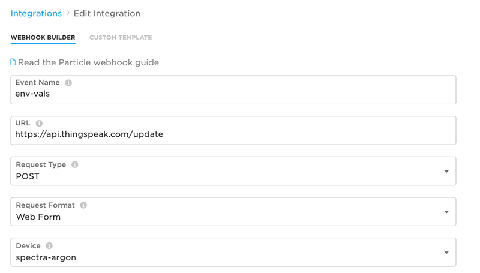

# Lab 4: Using Particle Webhooks with ThingSpeak

| **Project Goal**            | Use Particle Webhooks and Integrations to connect your app to ThingSpeak; B uilding dashboards in  ThingSpeak.                                                                                        |
| --------------------------- | ------------------------------------------------------------------------------------------------------------------------------------------------------------------------- |
| **What you’ll learn**       | Working with Particle Integrations and ThingSpeak |
| **Tools you’ll need**       | Particle Workbench, a [ThingSpeak](https://thingspeak.com/users/sign_up) account, a Particle Argon, and the IoT Starter Kit, a Particle Debugger.                                                                                                            |
| **Time needed to complete** | 60 minutes                                                                                                                                                                |

In this session, you're going to explore the power of Particle integrations with the popular ThingSpeak service, then build dashboards with ThingSpeak to visualize sensor data. If you get stuck at any point during this session, [click here for the completed, working source of the firmware changes you'll make in this lab](https://go.particle.io/shared_apps/5e5ebc3b81620d0022ad4e96).

## Introducing Particle Integrations and ThingSpeak

Before we set up an integration with ThingSpeak, we need to send data from our devices to the Particle Device Cloud.

### Publishing a payload with temp and humidity values

Let's send the current temp, humidity and light level using a `Particle.publish` event. You'll sind a single event with all three values in a single JSON object. To do this, you'll use the `JSONParserGenerator` library.

1. Open the Workbench Command Palette (CMD+SHIFT+P or CTRL+SHIFT+P) and select the "Particle: Install Library" option.

2. In the text box, type "JsonParserGeneratorRK" and click enter.

3. At the top of your project, add an include statement:

```cpp
#include "JsonParserGeneratorRK.h"
```

4. Add a new function to your app called `createEventPayload` that takes the temp, humidity and light readings. This function will create an instance of `JsonWriterStatic` and `JsonWriterAutoObject` objects, insert key-value pairs for each reading, and then get the JSON object as a string buffer that you can send along in a `Particle.publish()` event.

```cpp
void createEventPayload(int temp, int humidity, double light)
{
  JsonWriterStatic<256> jw;
  {
    JsonWriterAutoObject obj(&jw);

    jw.insertKeyValue("temp", temp);
    jw.insertKeyValue("humidity", humidity);
    jw.insertKeyValue("light", light);
  }
}
```

5. Now, let's publish a new event, and call the `createEventPayload` function to provide a formatted JSON string for the data parameter. Add the following to the end of your `createEventPayload` function.

```cpp
Particle.publish("env-vals", jw.getBuffer(), PRIVATE);
```

6. Finally, your `loop` function, call the `createEventPayload` function you just created.

```cpp
createEventPayload(temp, humidity, currentLightLevel);
```

7. Flash this firmware to your device and navigate to the Particle console. Every few seconds, you'll see a new `env-vals` event show up.


Now you're ready to set-up an integration.

### Setting up a ThingSpeak App

1. If you haven't already done so, create a [free ThingSpeak account](https://thingspeak.com/users/sign_up).


2. Once you've logged into your ThingSpeak account, navigate to the Channels tab and click "New Channel."


3. On the "New Channel" screen, add a name and desciption, and the values "temp", "humidity", and "light" in the first three fields. Set the Metadata field to "JSON" and click "Save Channel."


4. After you save, your channel dashboard will load, showing three charts and no values. Let's get those populated with your sensor data!


### Creating the Webhook to Publish to ThingSpeak

1. In the ThingSpeak dashboard for your channel, click on the "API Keys" tab and copy your Write API Key. You'll need that to set up your webhook.


2. Head back to the [Particle Console](https://console.particle.io) and click on the Integrations menu on the left nav.


3. Click the "New Integration" Card.


4. Click the "Webhook" Menu item.


5. In the Webhook builder, enter the name "env-vals" for the name (or whatever event name you chose in your firmware if you decided to be a maverick and do your own thing). For the URL, enter "https://api.thingspeak.com/update." Keep the request type as `POST` and change the Request Format to "Web Form". Select the name of your device from the Device drop-down.



6. Before saving, click "Advanced Settings" and the "Custom" option under form fields. Add four fields:

  - api_key > "Write API Key from ThingSpeak"
  - field1 > {{{`temp`}}}
  - field2 > {{{`humidity`}}}
  - field3 > {{{`light`}}}


7. Now Save. Wait a few seconds and refresh the page. Then, scroll to the bottom to confirm that events are being captured and sent sucessfully.


## Visualizing Sensor Data with ThingSpeak and MATLAB

Navigate back to your ThingSpeak channel and you should see the default charts update as data streams in from your device.


Let's customize these charts, add a few more, and explore creating advanced visualizations in MATLAB.

### Customizing Field Widgets

1. Click on the pencil icon on the top of "Field 1 Chat" to open the chart options window.


2. Set the title as "Temperature", the color as "#00aeef," the type to "spline" and click Save.


3. Repeat the process with the other charts and behold the Cyan goodness!


### Adding Widgets

Now let's add a new widget to show the current temperature on a Gauge.

1. On the Channel dashboard, click the "Add Widget" button.


2. Click the Gauge card, then click next.


3. In the widget parameters screen, modify the values to correspond to the image below.


4. Click save and your gauge should now be on screen, with the latest reading. It will also change as new data comes in.


### Creating Advanced Visualizations in MATLAB

Finally, let's use ThingSpeak's built-in support for MATLAB to create a basic histogram showing correlation between temperature and humidity data.

1. On the Channel dashboard, click the "MATLAB Visualization" button.


2. Under the examples section, click the "Visualize correlation between temperature and humidity."


3. In the MATLAB Code window that loads in the next screen, you'll need to change a few values including the `readChannelID`, the `TemperatureFieldID`, `HumidityFieldID`, `readAPIKey` and the integer value next to `NumPoints` on line 23. We've included the final code here, with a few placeholders you should change for your own channel and key values.

```Matlab
readChannelID = <your-channel-id>; 
TemperatureFieldID = 41 
HumidityFieldID = 2; 

% CHANGE KEY BELOW %
readAPIKey = '<read api key>'; 

% Change the default NumPoints of 300 to 100 %
data = thingSpeakRead(readChannelID,'Fields',[TemperatureFieldID HumidityFieldID], ...
                                               'NumPoints',100, ...
                                               'ReadKey',readAPIKey); 

temperatureData = data(:,1);
humidityData = data(:,2);

% Visualize the data
scatter(temperatureData,humidityData);
xlabel('Temperature');
ylabel('Humidity'); 
```

4. Once you've adapted the code accordingly, click "Save and Run." You'll see a scatter plot show-up in the output, and this new visualization will show up on your Channel dashboard as well!


<hr/>

**Congratulations! You've completed this workshop. Now you're a Particle Master! Take a moment to pat yourself on the back and bask in your newfound IoT-commandery. And if you want to take your exploration further, click the "Extra" link below!**


**BEFORE YOU GO** you'd love it if you could provide feedback on this workshop. Please visit [this link](https://particleiot.typeform.com/to/JiF8xM) to rate your experience.
